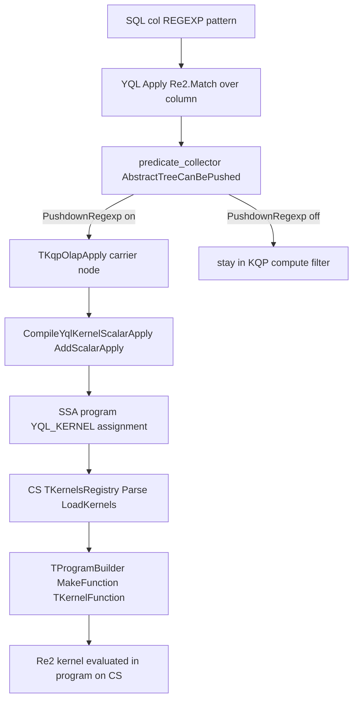

# Plan: Push down `REGEXP` to Column Shards behind `PRAGMA kikimr.OptEnableOlapPushdownRegexp`

## Goal

Allow queries such as:

```sql
PRAGMA kikimr.OptEnableOlapPushdownRegexp = "true";
SELECT * FROM t1 WHERE msg REGEXP '.*foo.bar.*' LIMIT 100;
```

to push the `REGEXP` predicate down into the column shard (CS), where it is evaluated inside the SSA program (as a YQL kernel), instead of reading the whole column into KQP and filtering there.

The new behavior is **opt-in** via a pragma/setting and defaults to OFF.

---

## Background — how pushdown works today (findings)

### 1. What `REGEXP` looks like in the expr graph
`col REGEXP 'pattern'` is lowered by YQL into an `Apply` of a `Re2.Match` / `Re2.Grep` UDF over the column member. `LIKE` / `ILIKE` produce the *same* shape, except the pattern is itself an `Apply` of the `Re2.PatternFromLike` UDF (optionally `Re2.Options`).

### 2. The pushdown gatekeeper (KQP, physical opt)
[`kqp/opt/physical/predicate_collector.cpp`](kqp/opt/physical/predicate_collector.cpp) drives what can be pushed:
- [`AbstractTreeCanBePushed()`](kqp/opt/physical/predicate_collector.cpp:143) accepts `Apply` nodes whose UDF name starts with `Json2.`, `Re2.`, or is a substring-match string UDF.
- Crucially, at [lines 167-172](kqp/opt/physical/predicate_collector.cpp:167) it **restricts `Re2.` to LIKE/ILIKE only**: it requires the UDF to be `Re2.PatternFromLike` / `Re2.Options`, or to contain a nested `Re2.PatternFromLike`. Plain `REGEXP` (a `Re2.Match`/`Re2.Grep` with a literal/parameter pattern) is deliberately rejected here. The comment literally says `// Pushdown only SQL LIKE or ILIKE.`
- This path only runs when `options.AllowOlapApply` is true (the "scalar apply" mechanism).

### 3. TPushdownOptions
[`kqp/opt/physical/predicate_collector.h`](kqp/opt/physical/predicate_collector.h:20) defines `TPushdownOptions { AllowOlapApply, PushdownSubstring, StripAliasPrefixFromColName }`. These are constructed in two callers:
- [`KqpPushOlapFilter`](kqp/opt/physical/kqp_opt_phy_olap_filter.cpp:1062) (classic physical optimizer)
- [`push_olap_filter.cpp`](kqp/opt/rbo/rules/push_olap_filter.cpp:99) (RBO rule)

Both build options from `Config->GetEnableOlapScalarApply()` and `Config->GetEnableOlapSubstringPushdown()`.

### 4. Building the pushed node (KQP, physical opt)
When a Re2 apply is pushable, the whole UDF lambda is wrapped into a [`TKqpOlapApply`](kqp/opt/physical/kqp_opt_phy_olap_filter.cpp:556) node (see `YqlApplyPushdown` referenced at [line 471](kqp/opt/physical/kqp_opt_phy_olap_filter.cpp:471)). This is the generic "scalar apply" carrier for arbitrary UDF lambdas.

### 5. Compiling to the SSA program (KQP, query compiler)
[`CompileYqlKernelScalarApply()`](kqp/query_compiler/kqp_olap_compiler.cpp:631) turns a `TKqpOlapApply` into a program assignment with `FunctionType = YQL_KERNEL`, using [`AddScalarApply()`](kqp/query_compiler/kqp_olap_compiler.cpp:650) to register the UDF lambda as a serialized arrow kernel. This is enabled by `GetEnableOlapScalarApply()`.

### 6. Executing on the column shard (CS)
- [`TKernelsRegistry::Parse()`](tx/program/registry.cpp:12) reconstructs a full MiniKQL function registry with `CreateBuiltinRegistry()` + `FillStaticModules()`, then `LoadKernels()` deserializes the kernels into `arrow::compute::ScalarFunction`s.
- [`TProgramBuilder::MakeFunction()`](tx/program/builder.cpp:21) picks up `YQL_KERNEL` functions and wraps them via `TKernelFunction` ([lines 56-62](tx/program/builder.cpp:56)); for known ops (StringContains/StartsWith/EndsWith/compares) it additionally attaches a `TLogicMatchString`/`TCompareKernel` "kernel logic" for index acceleration, but for a generic scalar-apply kernel it just executes the arrow kernel.

### Conclusion
**The CS already runs arbitrary YQL kernels through the exact scalar-apply path that ILIKE uses.** The Re2 kernel for plain `REGEXP` is just another arrow kernel serialized by `AddScalarApply`. Therefore **no new CS kernel infrastructure is required**; the core work is:
1. adding the pragma,
2. unblocking plain-Re2 in the gatekeeper behind that pragma,
3. verifying the apply-builder + compiler produce a valid node for `REGEXP`,
4. handling correctness edges on CS (NULL/Optional, invalid-regex semantics, index interaction),
5. tests + docs.

---

## Data flow (target)



---

## Implementation steps

### Step 1 — Add the setting `OptEnableOlapPushdownRegexp`
- [`kqp/provider/yql_kikimr_settings.h`](kqp/provider/yql_kikimr_settings.h:86): declare `NCommon::TConfSetting<bool, Static> OptEnableOlapPushdownRegexp;` next to the other OLAP pushdown settings.
- [`kqp/provider/yql_kikimr_settings.cpp`](kqp/provider/yql_kikimr_settings.cpp:88): `REGISTER_SETTING(*this, OptEnableOlapPushdownRegexp);`
- Add an accessor `GetEnableOlapPushdownRegexp()` following the pattern of [`GetEnableOlapPushdownAggregate()`](kqp/provider/yql_kikimr_settings.cpp:315) (pragma OR a service-config flag).
- Decide on server-config backing: add `optional bool EnableOlapPushdownRegexp` to [`protos/table_service_config.proto`](protos/table_service_config.proto:409) mirroring `EnableOlapScalarApply`/`EnableOlapSubstringPushdown` (choose default = false for a phased rollout; the pragma alone can also enable it). Wire it in the accessor.

### Step 2 — Thread a `PushdownRegexp` flag through `TPushdownOptions`
- [`kqp/opt/physical/predicate_collector.h`](kqp/opt/physical/predicate_collector.h:20): add `bool PushdownRegexp{false};` to `TPushdownOptions` and extend the constructor (keep it backward compatible with a default arg).
- Populate it in both callers:
  - [`KqpPushOlapFilter`](kqp/opt/physical/kqp_opt_phy_olap_filter.cpp:1062)
  - [`push_olap_filter.cpp`](kqp/opt/rbo/rules/push_olap_filter.cpp:99)
  from `Config->GetEnableOlapPushdownRegexp()`.
- Note: `PushdownRegexp` should imply the scalar-apply machinery is available. Guard so that regexp pushdown only happens when `AllowOlapApply` (scalar apply) is also on, since REGEXP is compiled through the scalar-apply kernel path.

### Step 3 — Relax the Re2 restriction in the gatekeeper
- In [`AbstractTreeCanBePushed()`](kqp/opt/physical/predicate_collector.cpp:167), change the LIKE-only guard so that when `pushdownOptions.PushdownRegexp` is enabled, a `Re2.Match` / `Re2.Grep` apply with a literal or parameter pattern is also accepted (i.e. do not require the nested `Re2.PatternFromLike`). Keep the current behavior unchanged when the flag is off.
- Be careful to still reject shapes that cannot be safely serialized/evaluated as a kernel (e.g. patterns that are not constants/parameters, or that reference other columns). Only column-vs-constant/param regexp should be pushable initially.
- The function signature already receives `TPushdownOptions pushdownOptions`, so no signature change is needed.

### Step 4 — Verify/extend the physical apply-builder
- Confirm that `YqlApplyPushdown` (invoked at [line 471](kqp/opt/physical/kqp_opt_phy_olap_filter.cpp:471)) already produces a correct `TKqpOlapApply` for a generic Re2 lambda. Since ILIKE goes through the same generic apply builder, `REGEXP` should also work, but validate:
  - the `KernelName` atom set on the `TKqpOlapApply` is sensible (e.g. the Re2 UDF name),
  - the lambda captures the pattern constant/parameter correctly.
- No changes expected here beyond confirmation; add handling only if a REGEXP-specific shape is not covered.

### Step 5 — CS-side correctness (the "handle properly on CS side" part)
The kernel executes through the existing scalar-apply path, but validate these semantics on the shard:
- **NULL / Optional handling:** a NULL input column value must yield NULL/false consistently with how KQP evaluates `REGEXP` on NULL today (regexp over NULL is NULL → row excluded). Confirm `TProgramBuilder`/kernel output is Optional-aware and that the filter step ([`TFilterProcessor`](tx/program/builder.cpp:372)) treats non-true as excluded. Mirror the ILIKE contract.
- **Invalid regex semantics:** current product behavior is "re2 ignores incorrect regexes" (see the note in [`kqp/ut/runtime/kqp_re2_ut.cpp`](kqp/ut/runtime/kqp_re2_ut.cpp:30)). The pushed-down kernel MUST preserve identical behavior (no error, matching current default) so that moving evaluation to CS does not change query results. This is the main correctness risk — verify the serialized Re2 kernel reproduces the same "ignore invalid pattern" outcome as the KQP-side execution.
- **Kernel logic / no false index acceleration:** unlike StringContains/StartsWith/EndsWith, `REGEXP` must NOT be attached to a `TLogicMatchString` index-check in [`tx/program/builder.cpp`](tx/program/builder.cpp:42) — a generic scalar-apply kernel already skips that branch (it is keyed on `YqlOperationId` values, which the scalar apply does not set to StringContains). Confirm the Re2 apply does not accidentally map to a substring op and thus wrongly consult substring/bloom indexes; it must be a full in-program scan.

### Step 6 — CS index interaction
- Ensure the new pushed predicate is treated as a non-indexable program computation: it should read the target column and evaluate the kernel per-row, never pruning portions via bloom/substring indexes (regexp is not anchored). Trace the filter through the reader to confirm no index optimizer picks it up incorrectly. If the index layer inspects operation type, verify `REGEXP` maps to "no index / full scan".

### Step 7 — KQP unit tests
Mirror the existing ILIKE pushdown tests:
- In [`kqp/ut/olap/kqp_olap_ut.cpp`](kqp/ut/olap/kqp_olap_ut.cpp:1539) (and the RBO variant [`kqp/ut/rbo/kqp_rbo_olap_ut.cpp`](kqp/ut/rbo/kqp_rbo_olap_ut.cpp:1222)) add a REGEXP suite:
  - With `PRAGMA kikimr.OptEnableOlapPushdownRegexp="true"`: assert the plan/AST contains `KqpOlapFilter` (pushdown happened) and results are correct for a variety of patterns (anchored, unanchored, character classes, NULL rows, parameterized pattern).
  - With the pragma off (default): assert the predicate is NOT pushed (filter remains in KQP), verifying opt-in behavior and no regression.
  - Include an invalid-regex case asserting behavior matches the current non-pushdown result.

### Step 8 — CS-level tests
- Add/extend a program test analogous to [`tx/columnshard/engines/ut/ut_program.cpp`](tx/columnshard/engines/ut/ut_program.cpp:313) and the kernel wrapper in [`tx/columnshard/test_helper/kernels_wrapper.cpp`](tx/columnshard/test_helper/kernels_wrapper.cpp:57) to construct a Re2 scalar-apply kernel and assert the CS evaluates it correctly, including NULL and invalid-pattern rows.
- Update any AST/plan golden assertions that change because REGEXP now compiles into an OLAP filter.

### Step 9 — Documentation
- Document `PRAGMA kikimr.OptEnableOlapPushdownRegexp` (and the optional server-config flag) alongside the other OLAP pushdown pragmas, noting: opt-in, applies to column tables, evaluates regexp in-program on CS, preserves current invalid-regex semantics.

---

## Files to touch (summary)

| Area | File | Change |
|------|------|--------|
| Setting decl | [`kqp/provider/yql_kikimr_settings.h`](kqp/provider/yql_kikimr_settings.h) | add `OptEnableOlapPushdownRegexp` + accessor |
| Setting reg | [`kqp/provider/yql_kikimr_settings.cpp`](kqp/provider/yql_kikimr_settings.cpp) | `REGISTER_SETTING` + `GetEnableOlapPushdownRegexp()` |
| Server cfg | [`protos/table_service_config.proto`](protos/table_service_config.proto) | optional backing flag |
| Options | [`kqp/opt/physical/predicate_collector.h`](kqp/opt/physical/predicate_collector.h) | add `PushdownRegexp` |
| Gatekeeper | [`kqp/opt/physical/predicate_collector.cpp`](kqp/opt/physical/predicate_collector.cpp) | relax Re2 LIKE-only guard when flag on |
| Callers | [`kqp/opt/physical/kqp_opt_phy_olap_filter.cpp`](kqp/opt/physical/kqp_opt_phy_olap_filter.cpp), [`kqp/opt/rbo/rules/push_olap_filter.cpp`](kqp/opt/rbo/rules/push_olap_filter.cpp) | pass new flag |
| Compiler | [`kqp/query_compiler/kqp_olap_compiler.cpp`](kqp/query_compiler/kqp_olap_compiler.cpp) | verify scalar-apply path (likely no change) |
| CS builder | [`tx/program/builder.cpp`](tx/program/builder.cpp) | verify generic kernel path, no false index op |
| Tests | `kqp/ut/olap/...`, `kqp/ut/rbo/...`, `tx/columnshard/engines/ut/ut_program.cpp` | new REGEXP pushdown + CS kernel tests |
| Docs | pragma docs | describe new pragma |

---

## Resolved decisions (approved)

1. **Default rollout:** server-config flag defaults **OFF** — enablement is **pragma opt-in only** (`PRAGMA kikimr.OptEnableOlapPushdownRegexp="true"`). The server-config flag exists for future phased rollout but is off by default.
2. **Scope of pushable REGEXP:** support **`column REGEXP <constant|parameter>` only** in this iteration. Patterns built from arbitrary expressions or referencing other columns are NOT pushed.
3. **Invalid-regex semantics:** **preserve the current "ignore invalid regex" behavior** on CS. Moving evaluation to the column shard must not change results; do not adopt the future feature-flagged error behavior referenced in [`kqp/ut/runtime/kqp_re2_ut.cpp`](kqp/ut/runtime/kqp_re2_ut.cpp:30).
4. **RBO + classic optimizer:** enable the pushdown in **both** the classic physical optimizer ([`KqpPushOlapFilter`](kqp/opt/physical/kqp_opt_phy_olap_filter.cpp:1062)) and the RBO rule ([`push_olap_filter.cpp`](kqp/opt/rbo/rules/push_olap_filter.cpp:99)).

---

## Implementation notes (DONE)

Status: **implemented and tested** (classic + RBO OLAP `PredicatePushdown_Regexp` unit tests pass).

### How REGEXP is pushed down

`col REGEXP 'pat'` lowers to `(Apply (Udf 'Re2.Grep '((String 'pat) (Nothing <opts>)) ...) col)` — the
pattern is curried into the UDF runConfig, and the `Apply` has the column as its single argument. This is the
same shape ILIKE uses, except ILIKE's pattern comes from a nested `Re2.PatternFromLike` UDF. The gatekeeper
[`AbstractTreeCanBePushed`](kqp/opt/physical/predicate_collector.cpp:143) previously allowed `Re2.*` applies
**only** when the pattern was `Re2.PatternFromLike`/`Re2.Options`. With `OptEnableOlapPushdownRegexp` on, that
guard is skipped so plain `Re2.Grep`/`Re2.Match` is also pushable. The rest of the pipeline is unchanged:
the generic scalar-apply builder [`YqlApplyPushdown`](kqp/opt/physical/kqp_opt_phy_olap_filter.cpp:718) wraps
it in a `TKqpOlapApply`, and [`CompileYqlKernelScalarApply`](kqp/query_compiler/kqp_olap_compiler.cpp:631)
serializes the lambda into an arrow kernel via `AddScalarApply`. No CS-side kernel change was needed; because
REGEXP becomes a generic scalar-apply kernel (not a known `string_contains`/`starts_with`/`ends_with` op), it
does not trigger substring/bloom index acceleration and correctly falls back to a full in-program column scan.

### Key bug found & fixed during Step 5

Threading `PushdownRegexp` only into the *initial* `CollectPredicates` call was not enough. `KqpPushOlapFilter`
(and the RBO rule) run a **second** `CollectPredicates` pass *after* peephole on the apply closure, and those
calls constructed a fresh `TPushdownOptions{true, PushdownSubstring}` that defaulted `PushdownRegexp=false`.
That made the second pass reject the Re2 apply, so the regexp landed in `remaining` and was never pushed. Fixed
by forwarding `PushdownRegexp` (and `StripAliasPrefixFromColName`) in both post-peephole calls:
[`kqp_opt_phy_olap_filter.cpp:1162`](kqp/opt/physical/kqp_opt_phy_olap_filter.cpp:1162) and
[`push_olap_filter.cpp:144`](kqp/opt/rbo/rules/push_olap_filter.cpp:144).

### Tests

- [`kqp/ut/olap/kqp_olap_ut.cpp`](kqp/ut/olap/kqp_olap_ut.cpp) — `KqpOlap::PredicatePushdown_Regexp`: pragma ON
  pushes down (`KqpOlapFilter` in AST) with correct results, pragma OFF (default) does **not** push down but
  still returns correct results, and an invalid regex `'('` is ignored (empty result, no error).
- [`kqp/ut/rbo/kqp_rbo_olap_ut.cpp`](kqp/ut/rbo/kqp_rbo_olap_ut.cpp) — `KqpRboOlap::PredicatePushdown_Regexp`:
  RBO (`EnableNewRBO`) variant asserting explain AST contains `KqpOlapFilter` and results are correct.

### Documentation

The pragma is documented via the proto field comment on
[`EnableOlapPushdownRegexp`](protos/table_service_config.proto) (field 141), consistent with how the sibling
OLAP pushdown flags (`EnableOlapScalarApply`, `EnableOlapSubstringPushdown`, `EnableOlapPushdownAggregate`) are
documented. No separate user-facing markdown for these pragmas exists in this repo.
