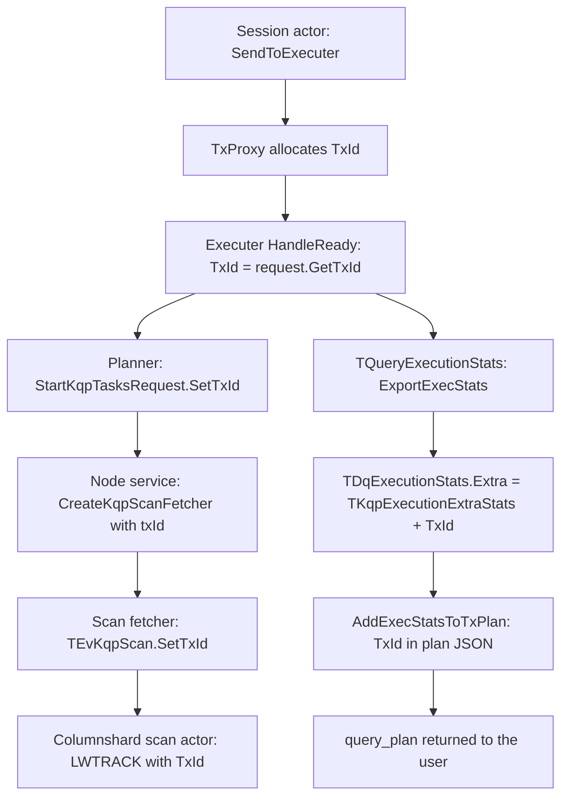

# Plan: expose query `TxId` in returned query stats (minimal first iteration)

## 1. Goal

When a user runs a query with full stats collection, the returned stats must
contain the executer `TxId` for every execution phase, so that this value can be
matched against the `TxId` written into LWTrace probes such as
[`ScanFinishSource`](tx/columnshard/engines/reader/actor/actor.cpp:136).

**Scope (agreed):** minimal first iteration —
internal proto field + populate it in `ExportExecStats` + surface it in the
query plan JSON. **No public API proto change**, no sys_view change, no docs in
this iteration; those are explicitly deferred to a follow-up.

Delivery vehicle for the user: the `TxId` becomes visible in the JSON query plan
(`query_plan` of the returned stats, i.e. `--stats full` in CLI, `EXPLAIN
ANALYZE` output and the UI plan viewer). No SDK or API changes required.

## 2. What the `TxId` in traces actually is (verified)

The `TxId` seen in columnshard trace probes is the **KQP executer transaction id**,
allocated by TxProxy when the session actor proposes the transaction
([`SendToExecuter`](kqp/session_actor/kqp_session_actor.cpp:2356) sends
`TEvTxUserProxy::TEvProposeKqpTransaction`).

Verified propagation chain:

| # | Place | Code |
|---|-------|------|
| 1 | Executer receives it | [`kqp_executer_impl.h:1069`](kqp/executer_actor/kqp_executer_impl.h:1069) — `TasksGraph.GetMeta().TxId = TxId = ev->Get()->Record.GetRequest().GetTxId();` |
| 2 | Sent to node service | [`kqp_planner.cpp:239`](kqp/executer_actor/kqp_planner.cpp:239) — `request.SetTxId(TxId)` |
| 3 | Node service → scan fetcher | [`kqp_query_control_plane.cpp:428`](kqp/node_service/kqp_query_control_plane.cpp:428) — `CreateKqpScanFetcher(..., txId, ...)` |
| 4 | Fetcher → shard scan request | [`kqp_scan_fetcher_actor.cpp:533`](kqp/compute_actor/kqp_scan_fetcher_actor.cpp:533) — `ev->Record.SetTxId(std::get<ui64>(TxId))` |
| 5 | Columnshard scan actor → LWTrace | [`actor.cpp:136`](tx/columnshard/engines/reader/actor/actor.cpp:136) — `LWTRACK(ScanFinishSource, *ScanOrbit, PathId, TabletId, TxId, ...)` |

So `TasksGraph.GetMeta().TxId` (== `TKqpExecuterBase::TxId`) is exactly the value
that must be surfaced in stats.



### Important semantics

* One query can produce **several** executer transactions, i.e. several
  `TDqExecutionStats` entries (one per physical tx / phase). Therefore `TxId` is
  a **per-execution (per-phase)** value, not a single query-level value.
* The **literal executer** ([`kqp_literal_executer.cpp`](kqp/executer_actor/kqp_literal_executer.cpp:434))
  never gets a TxId (`Request.NeedTxId == false`, `TxId` stays `0`). Literal
  phases never touch shards and produce no shard traces, so the field is simply
  omitted for them (see step 3).
* [`TBatchOperationExecutionStats`](kqp/executer_actor/kqp_executer_stats.cpp:1770)
  (partitioned executer) aggregates many executions and has no single TxId — it
  is **left unset** in this iteration (agreed).

## 3. Design decision — where to put the field

`TDqExecutionStats` lives in the external YQL/DQ library
(`ydb/library/yql/dq/actors/protos/dq_stats.proto:519`) and `TxId` is a
KQP-specific notion. It already carries a `google.protobuf.Any Extra = 100`
that KQP fills with [`NKqpProto::TKqpExecutionExtraStats`](protos/kqp_stats.proto:71).

**Chosen approach:** add `TxId` to `NKqpProto::TKqpExecutionExtraStats`
(KQP-owned proto, no changes to the shared YQL library proto), and read it back
when building the plan JSON.

Rejected alternatives (recorded for reviewers):
* adding `TxId` directly to `TDqExecutionStats` — touches a shared YQL library
  proto for a KQP-only concept;
* changing `Ydb.TableStats.QueryPhaseStats` now — requires public-API review;
  deferred to the follow-up;
* only logging it — does not satisfy the goal of getting the value back with the
  query result.

## 4. Implementation steps (this iteration)

### Step 1 — internal proto

In [`protos/kqp_stats.proto`](protos/kqp_stats.proto:71) add to
`TKqpExecutionExtraStats` (next free tag in the "basic stats" range is `4`;
`100/101` are profile stats):

```proto
message TKqpExecutionExtraStats {
    uint32 AffectedShards = 1;
    NYql.NDqProto.TDqStatsAggr ComputeCpuTimeUs = 2;
    NYql.NDqProto.TDqStatsAggr ShardsCpuTimeUs = 3;
    uint64 TxId = 4;   // executer transaction id, matches TxId in LWTrace probes
    ...
}
```

### Step 2 — populate it in the executer stats

In [`TQueryExecutionStats::ExportExecStats`](kqp/executer_actor/kqp_executer_stats.cpp:1515),
right next to the existing `ExtraStats.SetAffectedShards(...)` at
[line 1692](kqp/executer_actor/kqp_executer_stats.cpp:1692):

```cpp
ExtraStats.SetAffectedShards(AffectedShards.size());
if (TasksGraph && TasksGraph->GetMeta().TxId) {
    ExtraStats.SetTxId(TasksGraph->GetMeta().TxId);
}
stats.MutableExtra()->PackFrom(ExtraStats);
```

`TQueryExecutionStats` already holds
[`const TKqpTasksGraph* const TasksGraph`](kqp/executer_actor/kqp_executer_stats.h:415)
and [`TGraphMeta::TxId`](kqp/executer_actor/kqp_tasks_graph.h:200) is already
assigned in `HandleReady`, so **no new plumbing or constructor changes are
needed**. This single change covers all flows that call `ExportExecStats`:
* [`PassAway`](kqp/executer_actor/kqp_executer_impl.h:1829) — final response,
* [progress events](kqp/executer_actor/kqp_executer_impl.h:845),
* [`kqp_literal_executer.cpp:292`](kqp/executer_actor/kqp_literal_executer.cpp:292).

The `&& TasksGraph->GetMeta().TxId` guard keeps the output unchanged for literal
phases (TxId == 0) and keeps the null-`TasksGraph` case safe.

### Step 3 — surface `TxId` in the plan JSON

In [`AddExecStatsToTxPlan`](kqp/opt/kqp_query_plan.cpp:3219) (called from
[`PassAway`](kqp/executer_actor/kqp_executer_impl.h:1837) and from the
[literal executer](kqp/executer_actor/kqp_literal_executer.cpp:297) when full
stats are collected):

* unpack `stats.GetExtra()` into `NKqpProto::TKqpExecutionExtraStats`
  (same pattern as the existing task-level unpack at
  [line 3282](kqp/opt/kqp_query_plan.cpp:3282));
* if `TxId != 0`, write it into the root JSON node of the tx plan, next to where
  the per-node stats are attached
  ([lines 3609-3690](kqp/opt/kqp_query_plan.cpp:3609)), before the tree is
  serialized at [line 3692](kqp/opt/kqp_query_plan.cpp:3692).

Key name: `TxId` (consistent with the existing PascalCase keys in the plan JSON).

Since the plans produced here end up in
[`SerializeAnalyzePlan`](kqp/opt/kqp_query_plan.cpp:3702) via
`TxPlansWithStats`, the value automatically appears in `EXPLAIN ANALYZE` output
without touching that function.

No change is needed in
[`TKqpQueryStats::ToProto`](kqp/session_actor/kqp_query_stats.cpp:252) — the
executions are copied wholesale, so `Extra` (and thus `TxId`) is preserved.

## 5. Testing

* Unit test in `kqp/ut` (e.g. near
  [`kqp_query_perf_ut.cpp`](kqp/ut/perf/kqp_query_perf_ut.cpp:120)): run a query
  against a table with `STATS_COLLECTION_FULL`, parse `query_plan` from the
  returned stats and assert that a non-literal phase plan contains a non-zero
  `TxId`.
* Regression check for the literal-only query path: no `TxId` key emitted, no
  crash, null/zero-`TxId` handled.
* Optional manual/integration check: enable LWTrace on a columnshard scan query
  and confirm the `TxId` in the plan equals the one in the trace probes.
* Re-run existing plan/stats reference tests (e.g. `kqp/ut/opt`, `kqp/ut/cost`,
  `kqp/ut/indexes`) since a new key appears in the plan JSON.

## 6. Deferred to a follow-up (explicitly out of scope now)

* `uint64 tx_id` in `Ydb.TableStats.QueryPhaseStats`
  (`../public/api/protos/ydb_query_stats.proto`) plus filling it in
  [`FillQueryStats`](grpc_services/rpc_kqp_base.cpp:49) — needs public-API review.
* `TxId` in sys_view [`TQueryStats`](protos/sys_view.proto:106) /
  [`CollectQueryStats`](kqp/session_actor/kqp_query_stats.cpp:156) for
  top-queries views.
* `TxId` for the partitioned/batch executer
  ([`TBatchOperationExecutionStats`](kqp/executer_actor/kqp_executer_stats.cpp:1770)).
* An explicit `TxIds` summary block in
  [`SerializeAnalyzePlan`](kqp/opt/kqp_query_plan.cpp:3728) /
  [`SerializeRBOAnalyzePlan`](kqp/opt/rbo/kqp_plan_to_json.cpp:532).
* Documentation in `ydb/docs` describing the field and how to use it to locate
  LWTrace records.

## 7. Risks and review points

* A new key in the plan JSON may break reference-comparison tests — sweep and
  update them.
* `TxId` is per phase and absent for literal phases and batch operations; make
  this explicit in the commit description.
* Verify the new proto tag `4` is still free in `TKqpExecutionExtraStats` at
  merge time.
