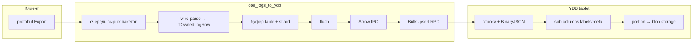

# OTLP Logs → YDB: `otel_logs_to_ydb`

Как **одна** OTLP-запись `LogRecord` превращается в **одну** строку column store в YDB: что парсится с wire, что кладётся в RAM, какие колонки уходят в `BulkUpsert`.

Прото: [logs_service.proto](https://github.com/open-telemetry/opentelemetry-proto/blob/main/opentelemetry/proto/collector/logs/v1/logs_service.proto), [logs.proto](https://github.com/open-telemetry/opentelemetry-proto/blob/main/opentelemetry/proto/logs/v1/logs.proto).

Конфиг по умолчанию в примерах: `bin/otel_logs_to_ydb.yaml` (`ingest_wire_to_owned: true`).

---

## 1. Вход

| | |
|---|---|
| Сервис / метод | `LogsService` / `Export` |
| Запрос | `ExportLogsServiceRequest` — на wire бинарный protobuf |
| Ответ | пустой `ExportLogsServiceResponse` |
| Слушатель | `grpc_listen` → `:8080` |

**Инвариант:** одна `LogRecord` → одна строка YDB. В одном `Export` может быть несколько `resource_logs` → разные таблицы; внутри `scope_logs` — много `log_records`.

### Дерево protobuf (только то, что нас интересует)

```
ExportLogsServiceRequest
└── resource_logs[]
    ├── resource.attributes[]     → project, cluster, service, hostname, …
    └── scope_logs[]
        ├── scope                 → пропускаем целиком (name, version, attrs)
        └── log_records[]         → одна строка YDB на запись
            ├── time_unix_nano
            ├── severity_number
            ├── body
            ├── attributes[]
            ├── trace_id, span_id
            └── observed_time, severity_text, flags, dropped_* → не пишем
```

---

## 2. Три формы одной строки (сквозной пример)

Ниже — **один и тот же** лог: от OTLP до строки в dedicated-таблице. Это центральная схема для презентации.

### 2.1. OTLP (логически, не wire)

**Resource** (общий контекст для всех `log_records` в этом `resource_logs`):

| key | value |
|-----|-------|
| project | techplatform |
| cluster | production |
| service | stq-agent |
| hostname | host-42.sas.yp-c.yandex.net |
| dc | sas |

**LogRecord:**

| поле OTLP | значение |
|-----------|----------|
| time_unix_nano | 1710000000123456789 |
| severity_number | 9 |
| body | `"POST /api/v1/task finished"` |
| attributes | request_id, record_id, http.status_code, http.route, user_login |
| trace_id / span_id | 16 / 8 байт → hex в labels |

### 2.2. В процессе: `TOwnedLogRow`

После wire-parse (`otel_logs_wire_ingest.cpp`) — **плоская** структура, без дерева protobuf:

```cpp
struct TOwnedLogRow {
    TInstant Ts;           // time_unix_nano → микросекунды UTC (0 → now)
    TString Service;       // из resource (см. §4.2)
    TString Cluster;       // resource["cluster"]
    TString RecordId;      // attr record_id или новый UUID
    i32 Level;             // severity_number
    TString Message;       // body → строка
    TString LabelsJson;    // UTF-8 JSON object (собран JsonStringifyMap, §5)
    TString MetaJson;
};
```

**Для примера выше:**

| поле `TOwnedLogRow` | значение |
|---------------------|----------|
| Ts | `2024-03-09 12:00:00.123456` UTC |
| Service | `stq-agent` |
| Cluster | `production` |
| RecordId | `a1b2c3d4-e5f6-7890-abcd-ef1234567890` |
| Level | `9` |
| Message | `POST /api/v1/task finished` |
| LabelsJson | см. ниже |
| MetaJson | см. ниже |

```json
// LabelsJson
{
  "request_id": "7f3c9e2a",
  "trace_id": "<hex 32>",
  "span_id": "<hex 16>",
  "project": "techplatform",
  "service": "stq-agent",
  "hostname": "host-42.sas.yp-c.yandex.net"
}
```

```json
// MetaJson
{
  "dc": "sas",
  "http.status_code": "200",
  "http.route": "/queues/api/add/{queue_name}/bulk",
  "user_login": "robot-market"
}
```

`record_id` **только** в колонке `RecordId`, в JSON labels **не** дублируется.  
`cluster` **не** в labels — в пути таблицы (dedicated) или в колонке `cluster` (common).

### 2.3. В YDB: колонки строки

Маршрут для примера: `(project=techplatform, cluster=production, service=stq-agent)` в списке `dedicated_service` → **Dedicated** schema.

**Путь таблицы:**

```text
{ydb_tables_prefix}/logs/techplatform/production/stq-agent
```

**Строка в таблице** (`STORE = COLUMN`, PK `(timestamp, record_id)`):

| timestamp | record_id | level | message | labels | meta |
|-----------|-----------|-------|---------|--------|------|
| 2024-03-09 12:00:00.123456 | a1b2c3d4-… | 9 | POST /api/v1/task finished | JsonDocument | JsonDocument |

В BulkUpsert с процесса `labels` и `meta` уходят как **UTF-8 текст JSON** (колонки Arrow `utf8`). На tablet конвертируются в **BinaryJSON** (§8).

`service` и `cluster` в dedicated **не** колонки — зашиты в **имени таблицы**.

### 2.4. Та же строка в common (PerService)

Если пара `(cluster, service)` **не** в `dedicated_service`:

**Путь:** `{prefix}/logs_store/techplatform/production/stq-agent`  
**PK:** `(timestamp, cluster, record_id)` — **7 колонок**, добавляется `cluster`:

| timestamp | **cluster** | record_id | level | message | labels | meta |
|-----------|-------------|-----------|-------|---------|--------|------|
| … | production | … | 9 | … | JSON | JSON |

`TOwnedLogRow` тот же; меняются только путь таблицы и набор колонок в Arrow.

### 2.5. Сводка: куда попадает каждое поле OTLP

| Источник OTLP | Dedicated | PerService | PerProjectHeap |
|---------------|-----------|------------|----------------|
| `time_unix_nano` | колонка `timestamp` | то же | то же |
| `severity_number` | `level` | то же | то же |
| `body` | `message` | то же | то же |
| attr `record_id` | `record_id` | то же | то же |
| `trace_id` / `span_id` | в JSON `labels` | то же | то же |
| resource `cluster` | путь таблицы | колонка `cluster` | колонка `cluster` |
| resource `service` (+ алиасы) | путь | путь + не колонка | колонка `service` |
| resource `project` | путь; может быть в `labels` | то же | путь / heap |
| label-keys resource + `request_id` | JSON `labels` | то же | то же |
| остальные attrs | JSON `meta` | то же | то же |
| `scope`, `severity_text`, `observed_time`, … | не сохраняются | | |

---

## 3. Пайплайн процесса



| Этап | Что лежит в памяти / на wire |
|------|------------------------------|
| Очередь ingest | `grpc::ByteBuffer` — сырой protobuf пакета |
| После parse | `THashMap<TBuck, TVector<TOwnedLogRow>>` — в каждой строке `LabelsJson`/`MetaJson` уже текст JSON (§5) |
| Буфер shard | накопление `TOwnedLogRow` до flush |
| Flush | чанк строк → `SerializeLogsBulkArrow` → schema + data IPC |
| YDB | column store insert (не S3; TTL — политика таблицы) |

**Flush:** ≥ `shard_buffer_min_flush_records` (5000) **или** ~`shard_buffer_flush_interval_sec` ± jitter (600 ± 300 с) на bucket. До **100 000** строк на один BulkUpsert, до **128** параллельных RPC (`ydb_max_concurrent_bulk`).

Параметры: `ingest_workers: 64`, `ingest_queue_max: 1000`, `batch_by_shard_hash: true`.

---

## 4. Wire-parse (текущий путь, `ingest_wire_to_owned: true`)

Полное дерево protobuf **не** строится. Читается wire тегами (`WireFormatLite` + `CodedInputStream`).

### 4.1. Порядок обхода

1. **`ExportLogsServiceRequest`** — только повторяющееся поле `resource_logs`; остальное `SkipField`.
2. **`ResourceLogs`** — весь под-message **копируется** в `blob[]`, затем **два прохода** по blob:
   - проход 1: `resource` → `attributes` → `THashMap` → `TResourceWireCtx` (project, cluster, service, ResourceLabels, ResourceMeta);
   - проход 2: `scope_logs` → для каждого `log_records` → `TOwnedLogRow`.
3. **`ScopeLogs`** — поле `scope` и всё прочее **пропускается**; читаются только `log_records`.
4. **`LogRecord`** — `time_unix_nano`, `severity_number`, `body`, `attributes`, `trace_id`, `span_id`; остальное skip (в т.ч. `observed_time` читается только если нет `time_unix_nano` для fallback timestamp).

### 4.2. Resource → контекст строки

| Атрибут resource | Куда |
|------------------|------|
| `project` | маршрутизация; может попасть в `labels` |
| `cluster` | `TOwnedLogRow.Cluster` и путь/колонка; **не** в labels JSON |
| `service`, `service.name`, `k8s.deployment.name`, `k8s.namespace.name` | `TOwnedLogRow.Service` (приоритет сверху вниз); дубликат может быть в labels |
| `hostname`, `host.name`, `host` | `labels` |
| прочие (`dc`, …) | `meta` |

Если `service` не найден → `"_unknown"`.

Фильтр `allowed_projects`: чужой `project` → весь `scope_logs` skip без parse записей.

### 4.3. LogRecord → поля строки

| Wire-поле | `TOwnedLogRow` / JSON |
|-----------|------------------------|
| `time_unix_nano` | `Ts` (ns / 1000 → µs); 0 → `TInstant::Now()` |
| `severity_number` | `Level` |
| `body` (AnyValue) | `Message` — см. §5 |
| `attributes["record_id"]` | `RecordId` (не в labels) |
| `attributes["request_id"]` | `labels` |
| прочие attributes | `meta` |
| `trace_id` / `span_id` | hex в `labels` (`trace_id`, `span_id`) |

Пустой `record_id` после разбора → `CreateGuidAsString()`.

### 4.4. AnyValue в атрибутах и body

| AnyValue | В `labels` / `meta` | В `message` |
|----------|---------------------|-------------|
| string | как есть | текст |
| int / bool / double | десятичная строка | — |
| bytes | raw в `TString` | — |
| array / kvlist | `"<non_scalar>"` если скаляр не выбран | — |
| сложный body | — | как для string или `<non_scalar>` |

Ключи JSON **плоские**: `"http.route"` — один ключ, не вложенный объект `http.route`.

### 4.5. Shard bucket

После строки: `ResolveLogsTable` → путь + `ELogsPkSchema`. Если `batch_by_shard_hash` — `TBuck.Shard = hash(PK columns) % partition_count`.

---

## 5. Правила `labels` и `meta`

На wire атрибуты сначала попадают в **`THashMap<TString, TString>`** (отдельно log / resource, labels / meta). В `LabelsJson` / `MetaJson` они превращаются только на финальном шаге — через **`JsonStringifyMap`** (`otel_logs_json.cpp`). До этого это не JSON, а пары ключ–значение в RAM.

### 5.1. Сборка одной строки (wire-path)

В конце `WireParseLogRecord` (`otel_logs_wire_ingest.cpp`):

```text
logLabels, logMeta          ← атрибуты LogRecord (classify)
       ↓ move
labels, meta                ← + trace_id / span_id (hex, copy в map)
       ↓ MergeStringMap
labels, meta                ← + resource label-keys / meta (см. ниже)
       ↓ JsonStringifyMap × 2
TOwnedLogRow.LabelsJson, .MetaJson   ← одна TString на поле
```

Тот же порядок в proto-path: `MakeOwnedLogRow` в `otel_logs_service.cpp`.

**`MergeStringMap`:** в `dst` уже есть ключи от log-record; из `src` (resource) добавляются **только отсутствующие** ключи. Значения при этом **копируются** (`(*dst)[k] = v`), не move. Итог: при конфликте побеждает значение из log, resource не перезаписывает.

**`JsonStringifyMap`:**

```cpp
THashMap → NJson::TJsonValue (map) → NJson::WriteJson → TString
```

- пустая map → `"{}"` без аллокации дерева;
- иначе для каждой пары `InsertValue(k, v)` — **копия** ключа и значения в `TJsonValue`;
- `WriteJson` — ещё одна **аллокация**: готовый UTF-8 текст в `LabelsJson` / `MetaJson`.

Промежуточное дерево JSON в строке **не** хранится — только итоговые две `TString` в `TOwnedLogRow`. При flush эти же байты снова **копируются** в Arrow `StringBuilder` (§7).

### 5.2. Какие ключи в какую map

**`labels` (до stringify):**

1. LogRecord: `request_id` (и прочие из `LogLabelAttrKeys`, кроме `record_id` — он в колонку).
2. `trace_id`, `span_id` — hex-строки в map.
3. Resource label-keys: `project`, `service`, `service.name`, `hostname`, `host.name`, `host` (не `cluster`).

**`meta`:**

1. Все остальные LogRecord.attributes.
2. Все остальные resource.attributes (через `MergeStringMap`, если ключа ещё нет).

Пустые значения отбрасываются ещё на этапе wire (в map не кладутся).

---

## 6. Маршрутизация таблиц

Префикс: `ydb_tables_prefix` (напр. `/olap-perf/deploy_logs`). Правила в `project_routing` / `dedicated_service` в yaml.

| Условие | Пример пути | Schema |
|---------|-------------|--------|
| `(cluster, service)` ∈ dedicated | `…/logs/techplatform/production/stq-agent` | Dedicated, 6 колонок в Arrow |
| иначе, `table_layout: per_service` | `…/logs_store/techplatform/production/stq-agent` | PerService, 7 колонок |
| `table_layout: per_project` | heap на проект | PerProjectHeap, 8 колонок |

`write_only_dedicated: true` — всё не-dedicated отбрасывается (`route.Drop`).

DDL и PK: `otel_logs_ddl.cpp`.

---

## 7. Где copy, где move

| Переход | Поведение |
|---------|-----------|
| gRPC → очередь ingest | **move** `ByteBuffer` |
| wire → атрибуты в `THashMap` | **copy** key/value с wire (`WireParseKeyValue`, classify) |
| `ResourceLogs` blob | **copy** в `TVector<char>` для двух проходов |
| merge resource → labels/meta | **copy** значений (`MergeStringMap`, только новые ключи) |
| `THashMap` → `LabelsJson` / `MetaJson` | **copy** в `TJsonValue` + **alloc** текста (`JsonStringifyMap`) |
| прочие поля строки (`Message`, `RecordId`, …) | **copy** / move по полю |
| `TOwnedLogRow` → буфер shard | **move** целиком (в т.ч. уже собранные JSON-строки) |
| буфер → flush chunk | **move** |
| `LabelsJson` / `MetaJson` → Arrow | **copy** в `StringBuilder::Append` |
| Arrow IPC → сеть → tablet | **copy** / приём буфера SDK |

На одну строку для JSON-полей типично **два прохода копирования значений**: map при parse, затем stringify; при flush — третье копирование тех же байт в Arrow (сами `TOwnedLogRow` между буфером и flush не пересобираются).

---

## 8. После `BulkUpsert` (кратко)

| Этап | Что происходит |
|------|----------------|
| RPC | `BulkUpsert`, `EDataFormat::ApacheArrow` (`otel_logs_service.cpp`) |
| Tablet | UTF-8 JSON в колонках `labels`/`meta` → `BinaryJSON` (`ydb/core/formats/arrow/converter.cpp`) |
| Insert | sub-columns для частых ключей JSON (`labels`/`meta`) — при insert, не compaction |
| Диск | portion → blob storage кластера |

`otel_logs_to_ydb` в S3 не пишет. Лимит ~64 MiB на gRPC BulkUpsert — на стороне ingest.

---

## 9. Arrow: колонки в RPC

`SerializeLogsBulkArrow` — колонки **строго** по schema таблицы:

| Schema | Колонки Arrow (порядок) |
|--------|-------------------------|
| Dedicated | timestamp, record_id, level, message, labels, meta |
| PerService | timestamp, cluster, record_id, level, message, labels, meta |
| PerProjectHeap | timestamp, service, cluster, record_id, level, message, labels, meta |

`timestamp` = `arrow::timestamp(MICRO)`; `labels`, `meta` = UTF-8 JSON **текст**.

---

## 10. Файлы в коде

| Что | Файл |
|-----|------|
| gRPC, очереди, flush, Arrow, BulkUpsert | `otel_logs_service.cpp` |
| Wire ingest | `otel_logs_wire_ingest.cpp` |
| JSON maps | `otel_logs_json.cpp` |
| Маршрутизация | `otel_logs_routing.cpp` |
| DDL / TTL | `otel_logs_ddl.cpp` |
| Строка после parse | `otel_logs_owned_row.h` |
| Shard hash | `otel_logs_shard_hash.cpp` |
| JsonDocument на tablet | `ydb/core/formats/arrow/converter.cpp` |
| Конфиг | `bin/otel_logs_to_ydb.yaml` |

Альтернатива wire-parse (если `ingest_wire_to_owned: false`): Arena + полный protobuf → `MakeOwnedLogRow` — та же `TOwnedLogRow`, другой CPU-профиль.
